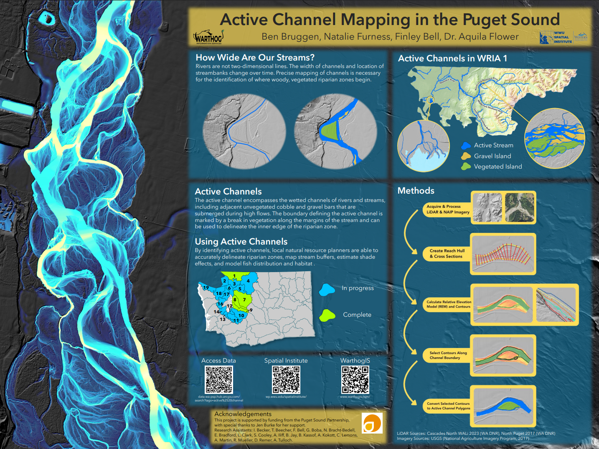
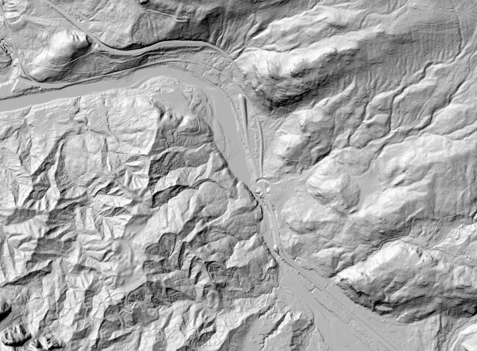

<!DOCTYPE html>
<html lang="en">
<head>
    <meta charset="UTF-8">
    <meta name="viewport" content="width=device-width, initial-scale=1.0">
    <title>Natalie Furness</title>
    <link rel="stylesheet" href="style.css">
</head>

<body>
    <header>
        <nav>
            <ul>
                <li><a href="index.html">Nat Furness</a></li>
                <li><a href="#my-work">Work Samples</a></li>
                <li><a href="#teaching">Teaching</a></li>
                <li><a href="#contact">Contact</a></li>
                <li><a href="https://www.linkedin.com/in/natalie-furness/">LinkedIn</a></li>
            </ul>
        </nav>
    </header>

      <section>
            

                <h2>Active Channel Mapping</h2>
                <h3>in the Puget Sound Region</h3>
                
In partnership with Puget Sound Partnership and WarthogIS,
                    I manage over 10 student employees (undergraduate and graduate),
                    perform quality assurance, and analyze active channels in the Puget Sound
                    using Python scripting and ArcGIS Pro tools.
                

                
Active channel hydrography is defined as an approximation of the active
                    channel width of a stream determined using remote sensing methods, like LiDAR,
                    and is inclusive of gravel and cobble bars and the wetted portion of the stream.
                

                    
                
The intent for these data is to identify the edge of the stream riparian
                    where woody vegetation begins, for riparian and ecosystem monitoring.
                

                <a href="https://data-wa-psp.hub.arcgis.com/search?tags=active%2520channel" class="cta-button">Access Data</a>
                <a href="https://pspwa.app.box.com/s/619ne5tbp4zkmrsa87dlc2v9ur6tspe4" class="cta-button secondary">Our Methods Manual</a>
            

        </section>

        <section>
            

         
         
   
        </section>

        <section id="acmapgrid">
            

                <h2>Process Images</h2>
            

            

            
             
            

        </section>

    <footer>
        <a href="https://www.linkedin.com/in/natalie-furness/">LinkedIn</a>
        <a href="#my-work">Work Examples</a>
        <a href='#contact'>Contact</a>
    </footer>
</body>
</html>
