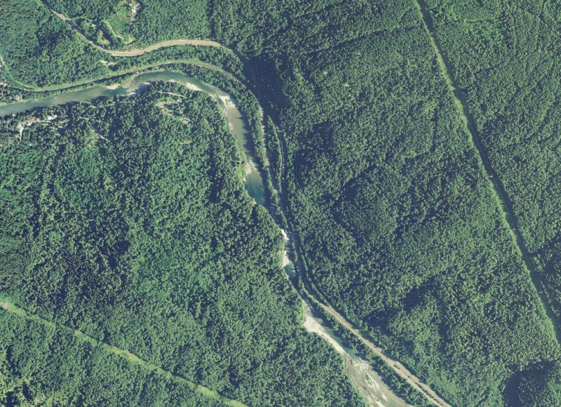

## Active Channel Mapping

**Project description:** Data from this project can be found at the [Puget Sound Partnership geospatial data hub](https://data-wa-psp.hub.arcgis.com/search?tags=active%2520channel).

### LiDAR and Aerial Imagery Example

**Project description:** LiDAR data is used to generate relative elevation models and contour lines. From there, we are able to create bank full width polygons of active stream channels.

